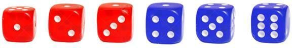
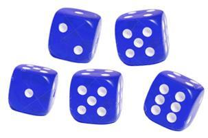
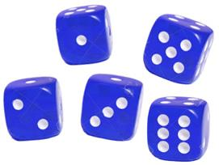

# Challenge Level

The rules for challenge level in cerberus are the same as in cogent.

> Cogent Roleplay revolves around a simple mechanic called the ‘**Challenge Level**’, or ‘**CL**’.
>
> When a player character chooses to make an action within the game, the Narrator can assign them a CL based on the difficulty of what they will attempt to perform – the more difficult the task, the higher the CL, ranging from 1 (a common task) to 8 (inconceivable!).

> On a traditional 6-sided dice (or ‘**D6**’) any dice roll that shows a **1-3** is considered a **loss**, While any dice that shows a **4-6** is a **win**.

> To pass the **Challenge** Level you must roll enough **wins** equivalent to, or greater than, the set CL.
For example:
Your character wants to climb a wall and the Narrator assigns this task a **CL** of **3**.
You have five dice to roll which means at least three dice must achieve a win to
succeed against the **CL**.

> The more dice a player has to roll against a CL, the higher the chance they will succeed.

